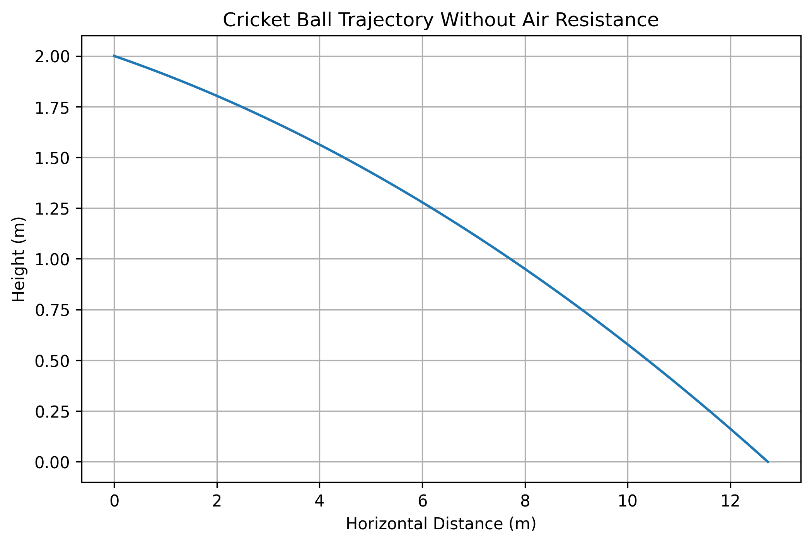
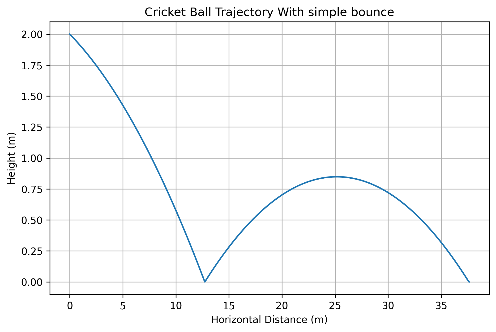
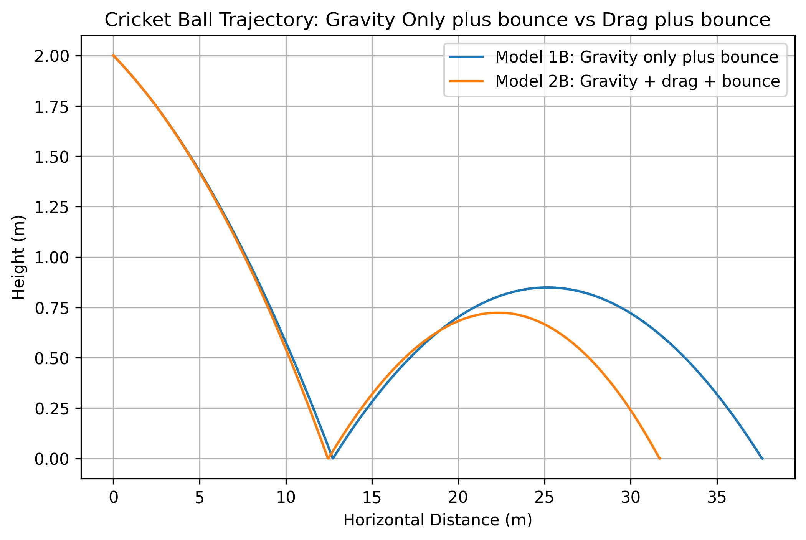
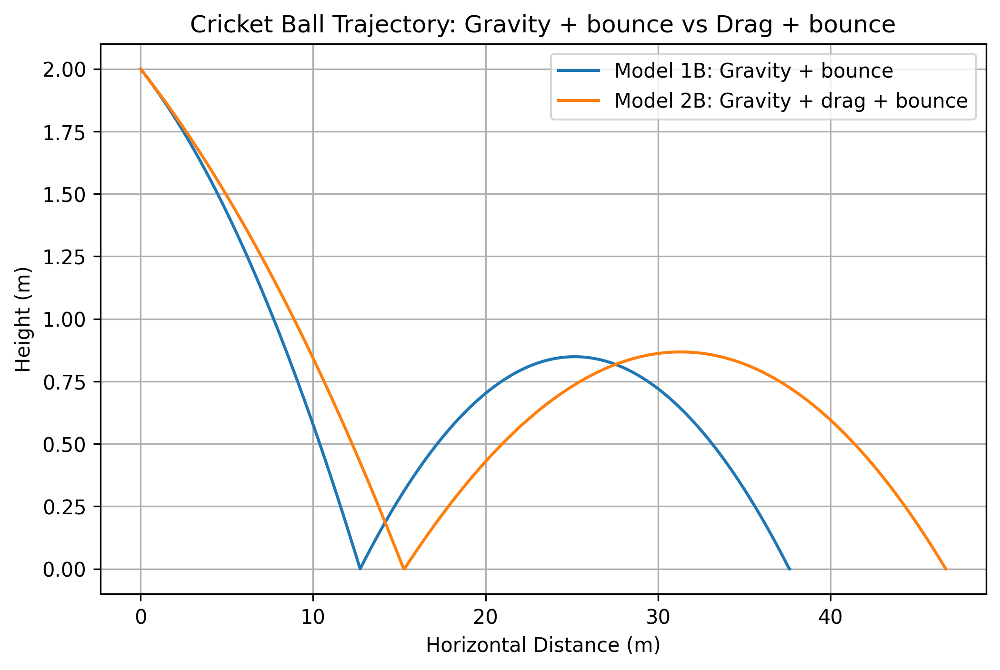
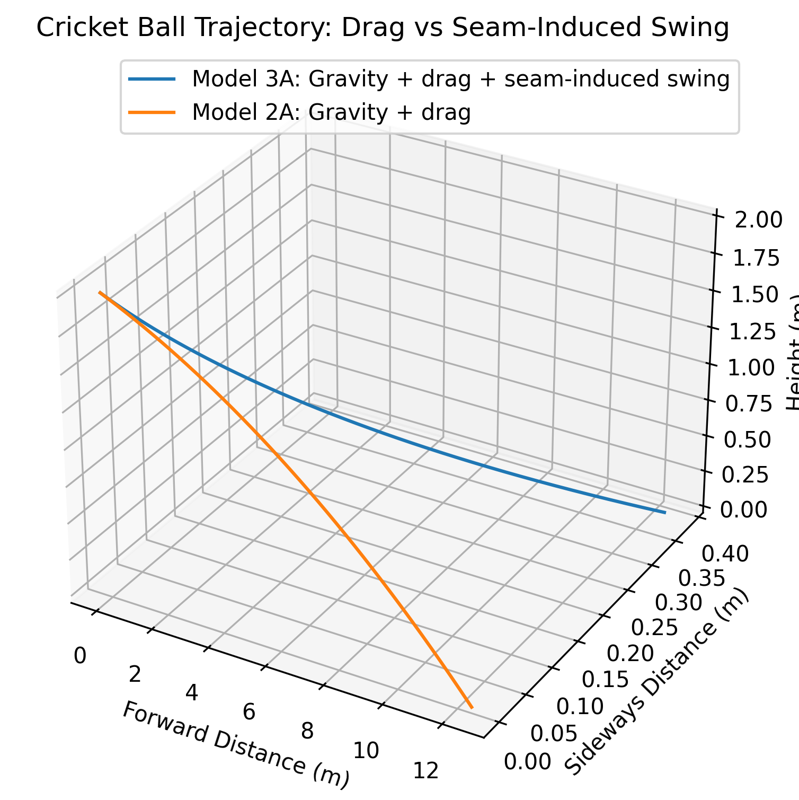
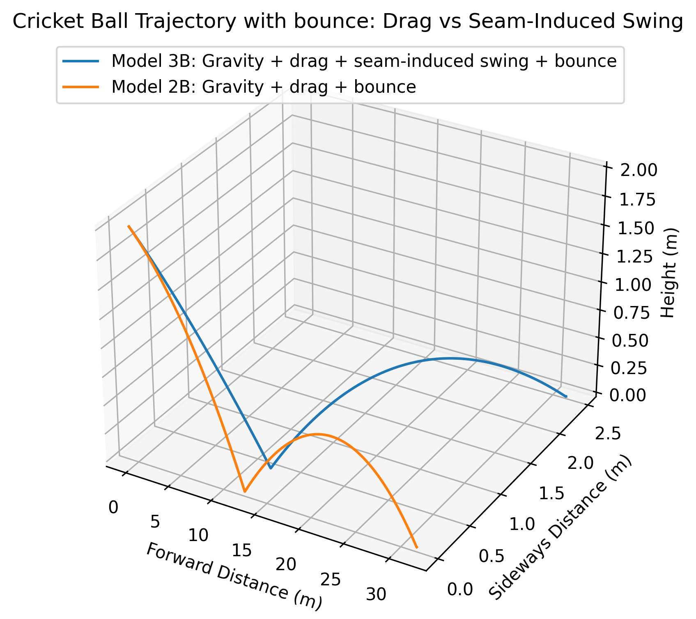

# Cricket-ball-physics
This project analyzes the physics of cricket ball motion during bowling. It examines how factors such as release speed, launch angle, air resistance, spin, and surface interaction affect the ball’s trajectory. The project focuses on pace bowling, where swing is influenced by aerodynamic forces, and spin bowling, where turn depends on spin rate, friction, and pitch conditions.

## Model 1A Output

The first version of the model simulates the motion of a cricket ball under gravity only.

## Model 1B Output

The simple bounce model adds one pitch contact using a coefficient of restitution.

## Model 2A Output

The second model adds drag along with gravity.

## Model 2B Output

This second model considers drag and gravity along with a simple bounce.

## Model 3A Output

This third model considers gravity, drag, and seam-induced swing.

## Model 3B Output

This third model considers gravity, drag, seam-induced swing, and bounce.

