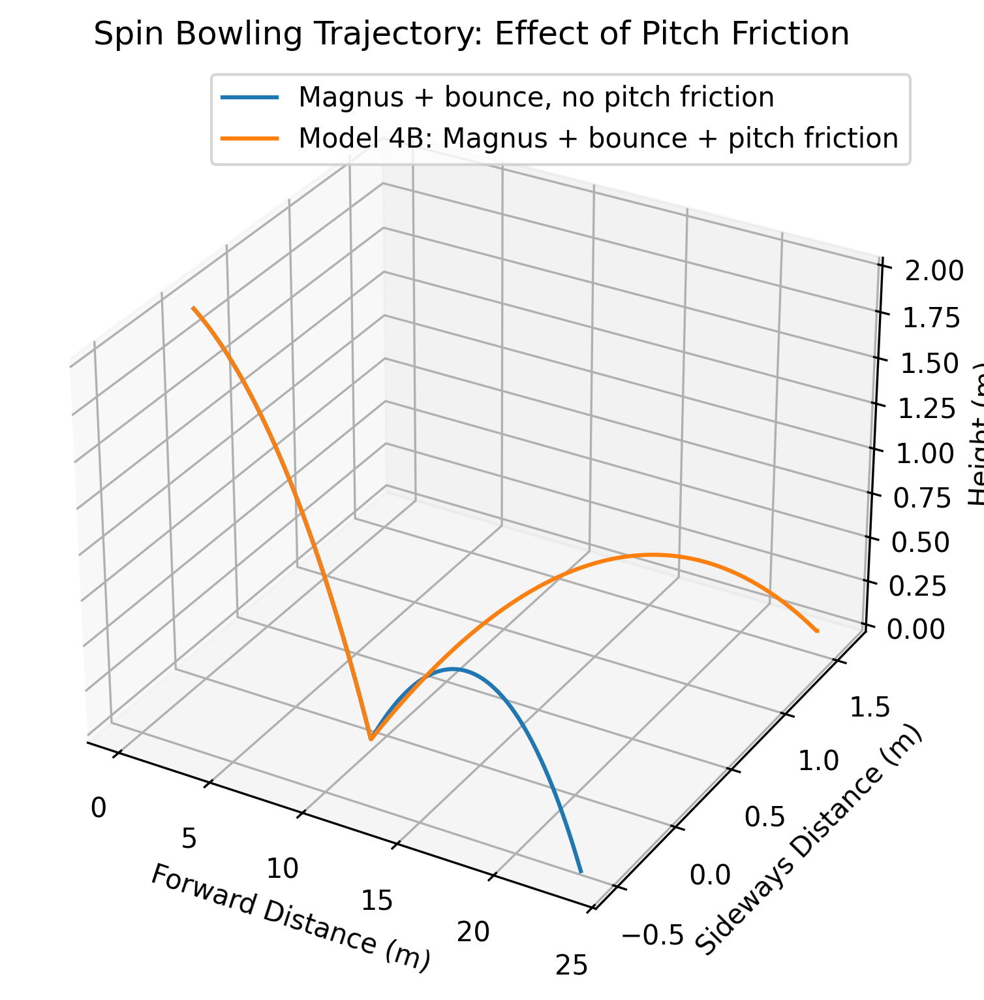

# Model 4B: Spin Bowling With Simplified Pitch Friction and Bounce

## Goal

Model 4B extends Model 4A by adding a simplified interaction between the spinning cricket ball and the pitch. Unlike Model 3, Model 4 will focus on the Magnus effect, which is more relevant to spin bowling. This model ignores seam-induced swing for model simplicity. The ball's motion will be affected by gravity, drag, and the Magnus effect. Model 4B considers the ball's motion through the air before and after the bounce. Bounce and pitch friction are included. 

## Coordinate System

The same coordinate system from Models 3 and 4A is used:

- \(x\): forward distance toward the batter
- \(y\): vertical height above the pitch
- \(z\): sideways displacement
  

## Assumptions

- The translational motion of the ball is tracked through its center of mass.
- Gravity is constant.
- Air resistance is included.
- The drag coefficient is treated as constant.
- The Magnus effect is included during flight.
- The Magnus coefficient is treated as constant.
- The angular velocity vector is treated as constant during flight.
- Wind is ignored.
- Seam-induced swing is not included.
- One bounce is included.
- The pitch is represented as a flat surface at \(y=0\).
- The coefficient of restitution is treated as constant.
- The coefficient of friction between the ball and pitch is treated as constant.
- The collision with the pitch is treated as instantaneous.
- The forward velocity is not changed instantaneously by pitch friction in this simplified model.
- The ball's spin vector is not changed during the bounce.
- The simulation stops when the ball reaches the pitch for the second time.

## Variables

| Variable | Meaning |
|---|---|
| \(x\) | forward position |
| \(y\) | vertical position |
| \(z\) | sideways position |
| \(v_x\) | forward velocity |
| \(v_y\) | vertical velocity |
| \(v_z\) | sideways velocity |
| \(v\) | total speed |
| \(m\) | mass of cricket ball |
| \(r\) | radius of cricket ball |
| \(A\) | cross-sectional area |
| $\(\rho\)$ | air density |
| \(C_D\) | drag coefficient |
| \(C_M\) | Magnus coefficient |
| $\(\vec\omega\)$ | angular velocity vector |
| \(F_D\) | drag-force magnitude |
| $\(\vec F_M\$) | Magnus-force vector |
| \(g\) | gravitational acceleration |
| \(e\) | coefficient of restitution |
| $\(\mu\$) | coefficient of friction |
| $\(J_n\$) | normal impulse during the bounce |
| $\(J_f\$) | sideways frictional impulse |
| \(s\) | direction of friction-induced turn |
| \(dt\) | simulation time step |

## Basic equations

The initial velocity is split into horizontal, vertical, and sideways components:

$$
v_x = v_0 \cos(\theta)
$$

$$
v_y = v_0 \sin(\theta)
$$

$$
v_z = 0  
$$

(Initial sideways velocity is zero as the bowler bowls)

$$
v=
\sqrt{v_x^2+v_y^2+v_z^2}
$$

Gravity acts vertically downward:

$$
\vec F_g=(0,-mg,0)
$$

The drag-force magnitude is:

$$
F_D=
\frac{1}{2}\rho C_DAv^2
$$

Drag acts opposite the direction of motion:

$$
\vec F_D=
-F_D\frac{\vec v}{v}
$$

The Magnus force caused by the spinning ball is:

$$
\boxed{
\vec F_M=
\frac{1}{2}\rho AC_Mv^2
\frac{\vec\omega\times\vec v}
{\left|\vec\omega\times\vec v\right|}
}
$$

$$
C_M=0.18
$$

as established in Model 4A.

The net force, while the ball is airborne:

$$
\vec F_g+\vec F_D+\vec F_M
$$

Newton's second law gives:

$$
\vec a=
\frac{\vec F_{\text{net}}}{m}
$$

The position and velocity are then updated using the same numerical method as the previous models.

# Pitch Interaction

## First Pitch Contact

The first pitch contact occurs when:

$$
y\leq0
$$

The vertical position is reset to:

$$
y=0
$$

Two simplified effects are then applied:

1. vertical bounce
2. sideways frictional impulse

## Vertical Bounce

As in the previous bounce models, the vertical velocity reverses direction and decreases in magnitude:

$$
v_{y,\mathrm{after}} = -e\,v_{y,\mathrm{before}}
$$

$$
e=0.60
$$

## Normal Impulse

Impulse represents the change in momentum during the short collision.

The normal impulse from the pitch is:

$$
J_n = m\left(v_{y,\text{after}} - v_{y,\text{before}}\right)
$$

Using the restitution equation:

$$
v_{y,\text{after}} = -e\,v_{y,\text{before}}
$$

gives:

$$
J_n = -m(1+e)v_{y,\text{before}}
$$

Because the ball is moving downward immediately before impact:

$$
v_{y,\text{before}}<0
$$

The magnitude of the normal impulse can be written as:

$$
\boxed{
J_n=
m(1+e)
\left|v_{y,\text{before}}\right|
}
$$

# Pitch Friction

A spinning cricket ball can interact with the pitch through friction.

Cricket ball-pitch simulations by Pandey and Rao (2020) found that changing the coefficient of friction affects rebound angle, rebound velocity, and post-impact spin.

For the simplified baseline:

$$
\boxed{\mu=0.30}
$$

Pandey and Rao used $\(\mu=0.30\)$ in one of their cricket ball-pitch simulations and also investigated a wider range of friction coefficients.

## Frictional Impulse

Instead of calculating the friction force at every instant of the very short collision, Model 4B represents friction using an impulse.
Model 4B uses a relationship from a research paper.

$$
\boxed{
J_f=\mu J_n
}
$$

This sliding-regime relationship is used in impulse-based collision models, including Doménech-Carbó (2024).

Substituting the normal impulse gives:

$$
J_f=
\mu m(1+e)
\left|v_{y,\text{before}}\right|
$$

# Sideways Change in Velocity

Impulse is related to change in momentum:

$$
J_f=m\Delta v_z
$$

Therefore:

$$
\Delta v_z=
\frac{J_f}{m}
$$

Substituting the frictional impulse gives:

$$
\boxed{
\Delta v_z=
\mu(1+e)
\left|v_{y,\text{before}}\right|
}
$$

## Direction of Turn

Friction also has a direction.

$$
s=\pm1
$$

where:

- \(s=+1\): friction produces turn in the positive \(z\)-direction
- \(s=-1\): friction produces turn in the negative \(z\)-direction

The value of \(s\) is chosen according to the direction of the ball's spin.

The sideways velocity immediately after the bounce becomes:

$$
\boxed{v_{z,\text{after}} = v_{z,\text{before}} + s\mu(1+e) \left|v_{y,\text{before}}\right|}
$$

This is the main new equation introduced in the simplified Model 4B.

---

## Forward Velocity During the Bounce

In the simplified model, pitch friction is used only to represent a sideways turn.

Therefore:

$$
\boxed{v_{x,\text{after}} = v_{x,\text{before}}}
$$

For simplification, forward velocity change is not included.

## Spin During the Bounce

The angular velocity is also kept constant:

$$
\boxed{\vec\omega_{\text{after}} = \vec\omega_{\text{before}}}
$$

This is another explicit simplification for model 4B.
As the ball goes back up in the air, it is affected by drag, gravity, and the Magnus force.

## Second Pitch Contact

When:

$$
y\leq0
$$

for the second time:

$$
y=0
$$

and the simulation stops.

# Expected Model Output

Model 4B should show that the direction of the post-bounce turn should reverse if the spin direction parameter $\(s\)$ is reversed. Increasing the coefficient of friction $\(\mu\)$ should produce a larger sideways velocity change in this simplified model. It includes the drag and force of gravity from previous models. However, instead of the swing force, we now have the Magnus force, which will result in a different trajectory from previous models.

## Model 4B Output

This fourth model considers spin bowling with gravity, drag, the Magnus effect, and bounce.

